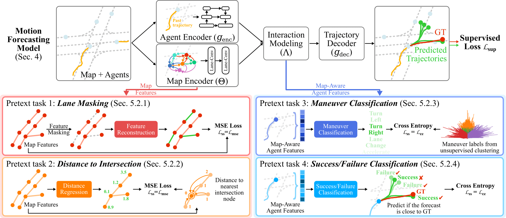
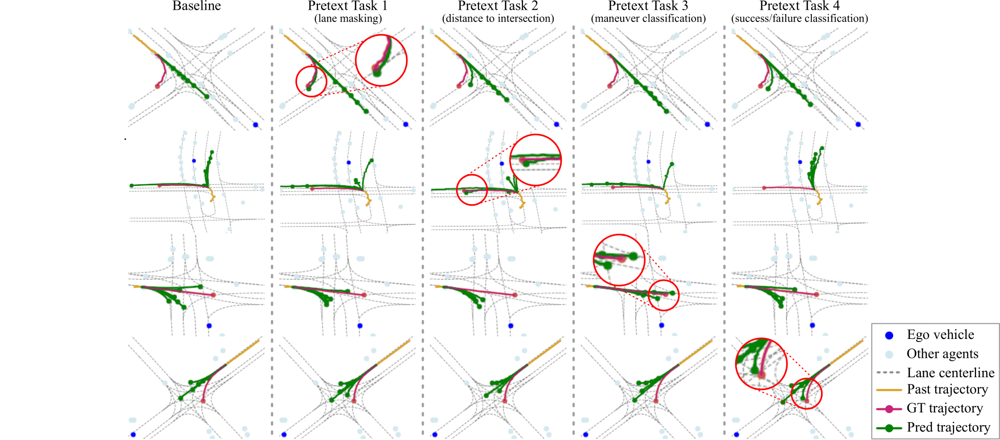

# SSL-Lanes: Self-Supervised Learning for Motion Forecasting in Autonomous Driving
By [Prarthana Bhattacharyya](https://scholar.google.com/citations?user=v6pGkNQAAAAJ&hl=en), [Chengjie Huang](https://scholar.google.com/citations?user=O6gvGZgAAAAJ&hl=en) and [Krzysztof Czarnecki](https://scholar.google.com/citations?hl=en&user=ZzCpumQAAAAJ).

We provide code support and configuration files to reproduce the results in the paper: SSL-Lanes: Self-Supervised Learning for Motion Forecasting in Autonomous Driving.
<br/> Our code is based on [Lane-GCN](https://github.com/uber-research/LaneGCN), which is a clean open-sourced project for motion forecasting methods. 

## Overview



In this study, we report the first systematic exploration and assessment of incorporating self-supervision into motion forecasting. We first propose to investigate four novel self-supervised learning tasks for motion forecasting with theoretical rationale and quantitative and qualitative comparisons on the challenging large-scale Argoverse dataset. Secondly, we point out that our auxiliary SSL-based learning setup not only outperforms forecasting methods which use transformers, complicated fusion mechanisms and sophisticated online dense goal candidate optimization algorithms in terms of performance accuracy, but also has low inference time and architectural complexity. Lastly, we conduct several experiments to understand why SSL improves motion forecasting. 

## Results
### Quantitative Results

For this repository, the expected performance on Argoverse 1 validation set is:

| Models | minADE | minFDE | MR |
| :--- | :---: | :---: | :---: |
| Baseline | 0.73 | 1.12 | 11.07 |
| Lane-Masking | 0.70 | 1.02 | 8.82 |
| Distance to Intersection | 0.71 | 1.04 | 8.93 |
| Maneuver Classification | 0.72 | 1.05 | 9.36 |
| Success/Failure Classification | 0.70 | 1.01 | 8.59 |

### Qualitative Results


## Pretrained Models

We provide the pretrained checkpoints for the proposed above-mentioned models in [checkpoints/](https://drive.google.com/drive/folders/1zSznQ0Jzi2fzxLX7xeQpUJppezU7J1v3?usp=sharing). 

### Inference validation set for metrics
To evaluate the prediction performance, run:
```
python test.py -m lanegcn --weight=lane_masking.ckpt --split=val
```

## Usage
1\. Clone this repository:
```
git clone https://github.com/AutoVision-cloud/SSL-Lanes
cd SSL-Lanes
```

2\. Following is an example of create environment **from scratch** with anaconda, you can use pip as well:
```sh
conda create --name lanegcn python=3.7
conda activate lanegcn
conda install pytorch==1.5.1 torchvision cudatoolkit=10.2 -c pytorch # pytorch=1.5.1 when the code is release

# install argoverse api
pip install  git+https://github.com/argoai/argoverse-api.git

# install others dependancy
pip install scikit-image IPython tqdm ipdb
```

3\. Install [Horovod](https://github.com/horovod/horovod#install) and `mpi4py` for distributed training. Horovod is more efficient than `nn.DataParallel` for mulit-gpu training and easier to use than `nn.DistributedDataParallel`. Before install horovod, make sure you have openmpi installed (`sudo apt-get install -y openmpi-bin`).
```sh
pip install mpi4py

# install horovod with GPU support, this may take a while
HOROVOD_GPU_OPERATIONS=NCCL pip install horovod==0.19.4

# if you have only SINGLE GPU, install for code-compatibility
pip install horovod
```
if you have any issues regarding horovod, please refer to [horovod github](https://github.com/horovod/horovod)


4\. Download [Argoverse Motion Forecasting Dataset v1.1](https://www.argoverse.org/av1.html). After downloading and extracting the tar.gz files, the dataset directory should be organized as follows:
```
/path/to/dataset_root/
├── train/
|   └── data/
|       ├── 1.csv
|       ├── 2.csv
|       ├── ...
└── val/
    └── data/
        ├── 1.csv
        ├── 2.csv
        ├── ...
```

5\. Download the processed data.
```sh
bash get_data.sh
```

## Training
### Training with Horovod-multigpus
Copy the contents of the pretext task into `ssl_pretext_tasks/LaneGCN` as follows:
```sh
cp -r ssl_pretext_tasks/lane_masking/final_task_masking/ ssl_pretext_tasks/LaneGCN/
```

```sh
# single node with 4 gpus
horovodrun -np 4 -H localhost:4 python /path/to/train.py -m lanegcn
```

## Citation
If you find this project useful in your research, please consider starring the repository and citing:
```bibtex
@misc{bhattacharyya2022ssllanes,
      title={SSL-Lanes: Self-Supervised Learning for Motion Forecasting in Autonomous Driving}, 
      author={Prarthana Bhattacharyya, Chengjie Huang and Krzysztof Czarnecki},
      year={2022},
      archivePrefix={arXiv},
      primaryClass={cs.CV}
}
```

## Acknowledgement
* [LaneGCN](https://github.com/uber-research/LaneGCN)
* [SelfTask-GNN](https://github.com/ChandlerBang/SelfTask-GNN)
* [SS-GCN](https://github.com/Shen-Lab/SS-GCNs)
